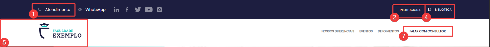
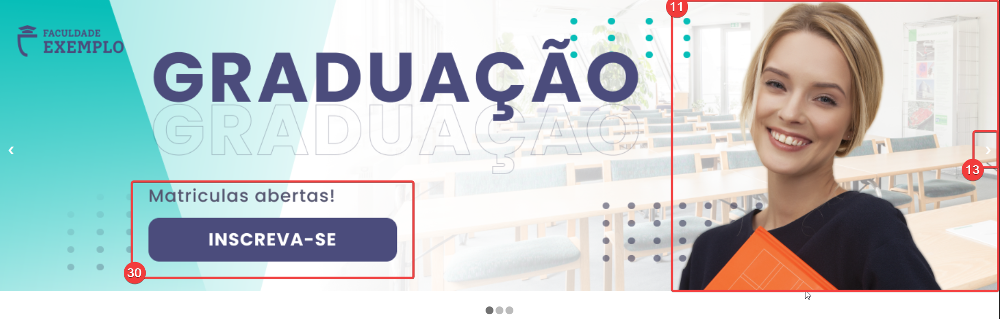
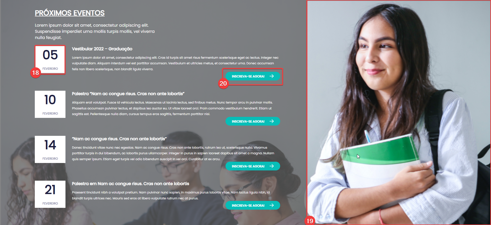
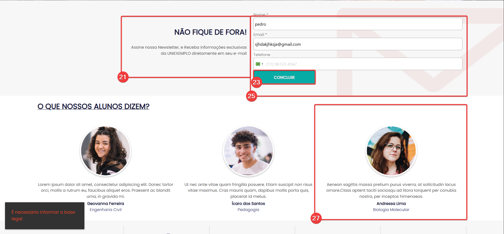

# Teste de Qualidade - Projeto Rubeus

## Relatório de Inspeção de Qualidade (QA) 

### Escopo dos Testes
Os testes foram realizados nos seguintes ambientes:
* **Landing Page Principal:** https://qualidade.apprbs.com.br/site
* **Página de Certificação:** https://qualidade.apprbs.com.br/certificacao

Este repositório contém o levantamento detalhado de falhas de **Funcionalidade (Utilidade)**, **Interface (Desejabilidade)** e **Experiência do Usuário (Usabilidade)** identificadas nos ambientes de teste.

---

### Resumo Executivo
Foram identificados **29 pontos de atenção**, categorizados conforme abaixo:
* **Críticos (Prioridade Alta):** Falhas de validação de formulário e navegação duplicada.
* **Médios (Prioridade Média):** Inconsistências de UI, falta de contraste e áreas de clique desalinhadas.
* **Baixos (Prioridade Baixa):** Ajustes estéticos, alinhamento de grid e padronização de fontes.

---

###  Detalhamento dos Problemas:

#### 1. Funcionalidade e Validação (Bugs Críticos)
* **Falha de Validação Obrigatória:** O formulário permite o envio (botão "Concluir") sem o preenchimento do campo de telefone.
* **Lógica de Erro Persistente:** Mensagens de erro em vermelho não desaparecem após o usuário corrigir ou apagar o conteúdo dos campos Nome/Email.
* **Redirecionamento Incorreto:** O link "Atendimento" abre o WhatsApp, duplicando a função do botão vizinho em vez de uma central de ajuda.

#### 2. Navegação e UX (Usabilidade)
* **Comportamento Duplicado:** Links como "Nossos Diferenciais", "Eventos" e "Depoimentos" abrem uma nova aba e fazem scroll na página atual simultaneamente.
* **Banners Inertes:** O carrossel principal não é clicável e as setas de navegação possuem visibilidade quase nula (falta de contraste).
* **Ausência de Hover:** Nenhum elemento interativo da página responde ao passar do mouse (hover), gerando incerteza sobre o que é clicável.

#### 3. Interface e Identidade Visual (UI)
* **Inconsistência de Fontes e Case:** Mistura de fontes em "Institucional" e "Biblioteca", além do uso despadronizado de UPPERCASE e Sentence case nos menus.
* **Erros de Alinhamento e Grid:**
    * Datas do carrossel desalinhadas verticalmente (número sobre o mês).
    * Logotipo fora do centro vertical do menu.
    * Rodapé com colunas e copyright totalmente desalinhados.
* **Qualidade de Imagem:** Banner principal com imagem borrada, distorcida (aspect ratio incorreto) e sem preenchimento automático de tela.
* **Hierarquia Visual:** Seção de depoimentos sem destaque; Redes sociais com tamanho desproporcional fora do rodapé.

---

###  Evidências:

  
📂 <b>Clique aqui para visualizar as capturas de tela (Evidências)</b>

   

  ### Evidência 01 - Cabeçalho e Menu
  

  ---

  ### Evidência 02 - Banner Principal
  

  ---

  ### Evidência 03 - Seção de Conteúdo
  

  ---

  ### Evidência 04 - Formulário de Lead
  

  ---

  ### Evidência 05 - Rodapé e Redes Sociais
  

---

###  Conclusão:
A aplicação apresenta uma estrutura base funcional, porém carece de polimento técnico na camada de front-end (CSS/Layout) e revisões de lógica no back-end para validação de dados. A correção dos itens de **Prioridade Alta** é recomendada antes da publicação em ambiente de produção para evitar a poluição do banco de dados com leads incompletos.

---

###  Detalhamento dos Itens:

**Item 01 – Link de "Atendimento" direcionando para WhatsApp**
* **Tipo:** Correção
* **Classificação:** Usabilidade (gera confusão no fluxo esperado pelo usuário)
* **Prioridade:** Média (o usuário consegue ser atendido, mas não da forma indicada pelo rótulo)
* **Descrição:** Ao clicar na opção "Atendimento", o sistema redireciona o usuário para o WhatsApp, o mesmo comportamento do botão vizinho. O esperado seria o direcionamento para uma página de suporte, central de ajuda ou formulário de contato.

**Item 02 – Inconsistência visual e falta de ícone em "Institucional"**
* **Tipo:** Melhoria
* **Classificação:** Desejabilidade
* **Prioridade:** Baixa
* **Descrição:** O item "Institucional" destoa dos demais elementos do cabeçalho por não possuir um ícone representativo, quebrando o padrão visual estabelecido em "Atendimento", "WhatsApp" e "Biblioteca".

**Item 03 – Tipografia inadequada (Font-family inconsistente)**
* **Tipo:** Melhoria
* **Classificação:** Desejabilidade
* **Prioridade:** Baixa
* **Descrição:** Os itens "Institucional" e "Biblioteca" utilizam uma caligrafia (fonte) que não harmoniza com o restante do sistema. Recomenda-se a padronização tipográfica para manter a identidade visual da aplicação.

**Item 04 – Espaçamento e distribuição irregular de ícones**
* **Tipo:** Melhoria
* **Classificação:** Desejabilidade
* **Prioridade:** Baixa
* **Descrição:** Os ícones de redes sociais e os links de menu apresentam um agrupamento irregular, com espaços em branco excessivos em algumas áreas e falta de alinhamento centralizado no container, prejudicando a estética da interface.

**Item 05 – Área de clique (Hitbox) desalinhada ou excessiva**
* **Tipo:** Correção
* **Classificação:** Usabilidade
* **Prioridade:** Média
* **Descrição:** A zona de interação (hitbox) dos ícones e textos do menu superior não está restrita aos limites visuais dos elementos. Existe um "vazamento" da área clicável para os espaços vazios ao redor, o que pode causar cliques acidentais e dificultar a navegação precisa do usuário. O esperado é que a área ativa corresponda exatamente ao tamanho do botão ou ícone.

**Item 06 – Comportamento de navegação duplicado em "Nossos Diferenciais"**
* **Tipo:** Correção
* **Classificação:** Usabilidade
* **Prioridade:** Alta
* **Descrição:** Ao clicar no link "Nossos Diferenciais", “Eventos” Depoimentos”, o sistema direciona a página atual para a seção correspondente e, simultaneamente, abre uma nova aba com o mesmo conteúdo. Isso gera poluição no navegador do usuário e uma quebra no fluxo de navegação esperado. O link deve apenas realizar o scroll na página atual ou abrir uma nova aba, nunca ambos.

**Item 07 – Falta de destaque e contraste no botão "Falar com Consultor"**
* **Tipo:** Melhoria
* **Classificação:** Desejabilidade
* **Prioridade:** Média
* **Descrição:** O botão de Call to Action (CTA) principal apresenta um design "vazio" (ghost button) que não atrai a atenção necessária. Ele parece "perdido" no cabeçalho por não possuir uma cor de destaque que o diferencie dos links comuns de navegação, dificultando a conversão.

**Item 08 – Inconsistência de "Case" (Maiúsculas e Minúsculas) nos menus**
* **Tipo:** Melhoria
* **Classificação:** Desejabilidade
* **Prioridade:** Baixa
* **Descrição:** Existe uma falta de padronização na identidade visual entre as seções da página. No menu superior, os itens utilizam "Sentence case" (ex: Atendimento, WhatsApp), enquanto no menu inferior (claro), os itens estão todos em "UPPERCASE" (ex: NOSSOS DIFERENCIAIS, EVENTOS).

**Item 09 – Desalinhamento vertical do Logotipo**
* **Tipo:** Melhoria
* **Classificação:** Desejabilidade
* **Prioridade:** Baixa
* **Descrição:** O logotipo "FACULDADE EXEMPLO" apresenta um leve desalinhamento em relação ao centro vertical dos itens de menu posicionados à direita. Este problema de alinhamento de grid prejudica a harmonia visual do cabeçalho.

**Item 10 – Ausência generalizada de Feedback Visual (Hover)**
* **Tipo:** Melhoria
* **Classificação:** Desejabilidade
* **Prioridade:** Média
* **Descrição:** Nenhum elemento interativo da página (botões, ícones de redes sociais ou links de menu) apresenta mudança de estado, como alteração de cor, brilho ou preenchimento, ao sofrer a interação do cursor (hover). Essa falta de resposta visual prejudica a navegabilidade, pois o usuário não recebe confirmação imediata de que o item é clicável antes de efetuar a ação.

### Ciclo de Teste 01 - Página de Site
**Ambiente de Teste (URL):** https://qualidade.apprbs.com.br/site
